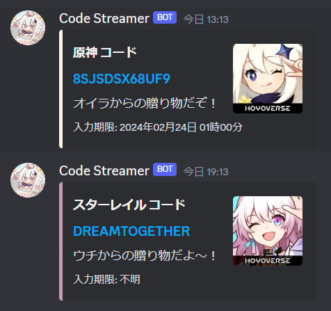

# Code-Streamer

原神・崩壊:スターレイルで不定期に発表されるアイテムコードを一括配信するDiscord-botです。

## 機能

<br>
コードが設定されたリンクを配信します。

## コマンド
`/ping`　応答をチェックします<br>
`/コード配信`　コードを配信します
```
/コード配信 {game} {inputcode} {deadline}
game: 原神，スタレから選択
inputcode: コードを入力
deadline: コードの入力期限を入力(任意)

例
/コード配信 game:原神 inputcode:TESTCODE deadline:202412312359
```

## 使用上の注意等
- 「code」という名前のチャンネルを送信したいサーバー内に作成してください。(完全一致するチャンネルにのみ配信されるので、前後に文字を追加しないでください)
- `deadline`は`yyyymmddhhmm`の形式のみ対応しています。入力期限が不明/ない場合は`inputcode`まで指定して(deadline:を入力せず)そのまま送信してください。
- <b>botがいるチャンネルでは誰でもコマンドを実行できてしまうため、管理者ロールにのみコマンド実行権限を設定してください。</b>
- プログラムの拙さについては初心者のため温かい目で見ていただけると助かります。またバグ修正等は脆弱性対応を除いてできない場合があります。

## 導入
- サーバーを立ち上げて動作させてください。
- discord.jsなどの導入も済ませておくこと。
コマンド登録は以下を実行
```
node deploy-commands.js
```
